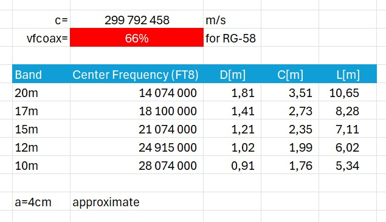

# Double Bazooka Antenna (DBZ)

## Overview
A Double Bazooka Antenna (DBZ) sometimes referred as coaxial dipole is a broad-banded variant of half-wave dipole antenna. As opposed to dipole, double bazooka is a monoband antenna in a sense that it is resonant only at its operational frequency, and not on its harmonics. Original design developed for radar applications by MIT in the early 1940’s used coaxial cable for entire length of radiating element [3]. DBZs used by hams today use combination of both coax and wire stabs as radiators.

## Advantages of Double Bazooka Antenna:

- design simplicity (i.e. no coils or transformers are required to match its impedance to 50ohm)
- about 14% larger then conventional dipols operational bandwidth possible to achieve without antenna tuner [1][5]
- less noise in received signal - I could not confirm this in real live deployment
- cost effective - you just need a few meters of coax you probably already have in your shack 

## Disadvantages of Double Bazooka Antenna:
- more mechanically fragile design then standard dipole (joint point between coax and stab wire is particularly sensitive area)
- weight (coax is typically heavier then regular wire)

In my case I decided to build DBZ antenna only because of its simplistic design i.e. lack of matching transformer.

## Principles of operation:
With a classic dipole, the resistance value and the reactance (reactive component) at the feed point diverge rapidly with increasing frequency - the SWR deteriorates [2]. Use of coaxial cable as part of radiating elements in the double bazooka results in a lower reactance at the feadpoint near antennas resonant frequency [6]. Lower reactance translates to a wider range of frequencies where the antenna can maintain a good match with the feedline, thus rendering it more braodband. It shall be noted however that the extend to which double bazooka is more bradband then standard dipol has been heavily debated over the years [5]. 

## Design details:

DBZ antenna:

where:

Coaxial stab length: $C = (c * Vfcoax / (4 * f))$

Wire extension length: $D = (c / (4 * f)) * (1 - Vfcoax)$ 

The speed of light in free space: $c = 299 792 458 m/s$

The velocity factor of used coax: $Vfcoax$, which in case of RG-58 is equal to 0.66 

see section "Antenna Dimensions Detailed Calculations" for more details how DBZ antenna dimensions can be derived.

Design practical considerations:

Avoid any coax that has a double shield with a foil wrapping. In my case I have used cheap RG-58. According to [1] using coax with larger diameter would lead to broader bandwidth - I have not experimented with this claim.

Calculate wire and coax dimensions using calculator from [1] or attached xls calculator and then cut material accordingly. In case of wire extensions remember to add a few centemeters extra.

Elements dimentions for selected ham bands are given below:

Use insulation remover when removing coax outer jacket (about 4 cm) so shield is left in tact. 

Cut the shielding in the center and separate it into two braids. Connect one of the two braids to the center wire of the feed line, and the second braid the feed line shield.

Do not cut or damage the center dielectric of the coax since it would weaken antenna structure. 

At both ends of coaxial stab, solder the shield and the center conductor together and attach it to the coper wire. I have done it using wing screw:

Use extra cord to support your antenna:

Ensure feed line does not put too much force on UC connector:

## Mounting options:

The Double Bazooka, like any dipole, can be set up either horizontally or as an 'inverted vee' antenna. In the case of stretched suspension, the directional diagram of the antenna has clear nulls in the direction of the wire. This can be used if the direction of the antenna can be freely chosen, for example to suppress QRM. When mounted as an 'inverted vee', the antenna has an omnidirectional characteristic. As with all antennas, the feed point should be mounted as high as possible [2].

Be aware that placing feedline in close proximity parallel to radiating element(s) will significantly increase SWR measured at the transceiver!

## Summary
I am super happy with performance of DBZ antenna mounted in inverted vee configuration (feed point at about 3m above the ground). I deployed it at my QTH to cover law signal stations especially from Australia, South East Asia and South America, which I received with signal strength below -7dB (wsjtx) using my original setup based on endfed antenna. Now on 17m band for which I built my first DBZ I am able to successfuly make a FT8 QSL when station is received at -11dB and lower! 
My station signal reports I receive are much more in line with signal levels of my correspondents as well! 

## Antenna Dimensions Detailed Calculations

Total length of DBZ radiating element (coax stabs + wire extensions) is equal to the half dipol made of coper wire:

$L = lambda / 2$ 
    
where $lambda$ is calculated assuming velocity factor of the wire, which in case of cooper is practically equal to 1. 

this gives:

$L = c / (2 * f)$

The total length of the coax stabs:

$2 * C = 2 * (lambda / 4)=lambda / 2$ 

where lambda is calculated assuming velocity factor of the coax, which in case of RG-58 is equal to 0.66 (66%)

From above the length of wire extension attached to each side of coax stab is:

$D = (L - 2 * C) / 2$
$D = (lambda(in wire) / 2 - lambda(in coax)/2)/2 = (1/4)*(lambda(in wire) - lambda(in coax)$

where

Wave length in environment characterized by velocity factor $Vf$: $lambda = (c * Vf) / f$

Wire extension length: $D = (c / (4 * f)) * (1 - Vfcoax)$ 

and 

Coaxial stab length: $C = (c * Vfcoax / (4 * f))$

where c is a speed of light in free space, which is equal to 299 792 458 m/s  

## Sources
[1] Antenna description and calculator: https://0x9900.com/building-a-double-bazooka-antenna/

[2] Practical design description: https://www.wimo.com/en/eantenna-bazooka-antenna

[3] Practical design description: https://webclass.org/k5ijb/antennas/Bazooka-dipole-antenna.htm

[4] Understanding Antennas for The Non-Technical Ham by Jim Abercrombie, N4JA https://w6sd.com/wp-content/uploads/Understanding_Antennas_For_The-Non-Technical_Ham.pdf

[5] The Broadband Double-Bazooka Antenna — How Broad Is It, Walter Maxwell W2DU

[6] The Story of the Broadband Dipole, Dave Leeson W6NL